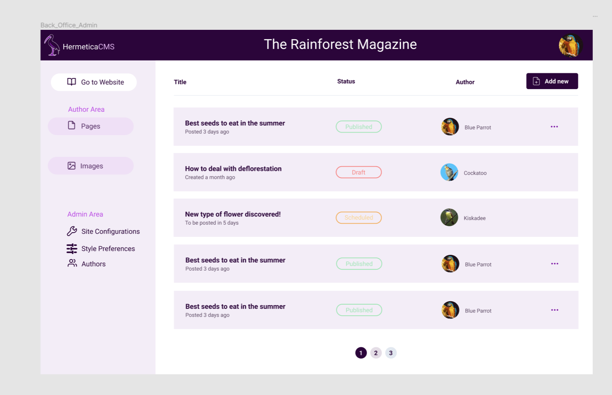

# HERMETICACMS - Web App

Web Application for the Hermetica system. It displays a "Back Office" for users to edit their personal websites, and also contains the code for those sites.

Each site contains a series of Pages, similar to social media posts, and inside those pages are blocks, which can be written and organized in the "Back Office".

Each page can be in one of three states: Draft, Scheculed or Published. Each block can be of three types: Header, Paragraph and Images.

The "Back Office" Author Area includes a section to manage their own pages, and also add and manage images they added to a shared collection between the website.

The "Back Office" also includes an Admin Area, in which the Authors, Style preferences and URL of the website can be managed by the admin of the website. The admins can also manage every page and image on the website.

The Users can view their profile page, and manage the websites in which they are admin and author, visualize invites to be authors in other people's websites and also create new websites.

## Figma Design

[Link](https://www.figma.com/file/VqQqJGlDKMG0vimXz4njzt/HermeticaCMS?type=design&node-id=0%3A1&mode=design&t=Xh41ctoDBVOfjk0U-1)

This is a React project created with Vite.

## Prerequisites

Before you begin, ensure you have met the following requirements:

-   You have installed the latest version of [Node.js and npm](https://nodejs.org/en/download/).
-   You have a Windows/Linux/Mac machine.

## Installing <HermeticaCMS-WebApp>

To install <HermeticaCMS-WebApp>, follow these steps:

1. Clone the repository:

git clone https://github.com/vhpadula/HermeticaCMS-WebApp.git

2. Navigate into the project directory:

cd HermeticaCMS-WebApp

3. Install the dependencies:

npm install

## Using <HermeticaCMS-WebApp>

To use <HermeticaCMS-WebApp>, follow these steps:

1. Start the development server:
   npm run dev

2. Open your browser and navigate to `http://localhost:5000`.

## Contact

If you want to contact me you can reach me at `<victorhpadula@gmail.com>`.

## License

This project uses the MIT License. See the [LICENSE.txt](./LICENSE.txt) file for details.
